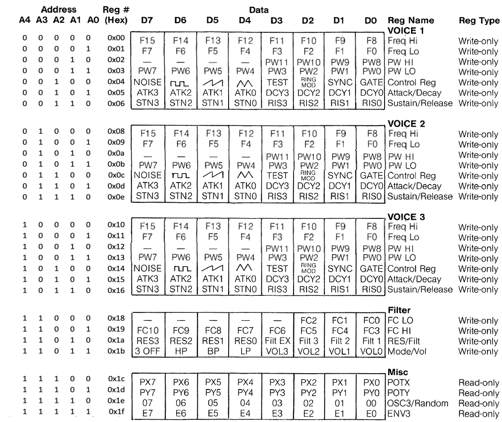

# E64


## General Description

E64 is a Virtual Computer System that runs on macOS and linux. Technical specifications are heavily inspired by the Commodore 64, Amiga 500 and Atari ST. The programming model is very comparable to fantasy consoles such as TIC-80 and PICO-8.

* The core is a Lua scripting engine
* BLITTER/VIDEO chip with a resolution of 384x216 pixels, a palette of 4096 colors (12bit) running at 60Hz, alpha blending capabilities and 16mb video ram.
* Sound:
	* Four SID chips (MOS 6581). Each individual SID chip runs at 985248Hz for the same pitch as the chips in the original C64 pal version. Emulation is achieved with the excellent [reSID](http://www.zimmers.net/anonftp/pub/cbm/crossplatform/emulators/resid/index.html) library by Dag Lem. Registers are remapped to enable big endian systems.
	* Four Analog Sound Devices capable of pure sinusoidal sound next to all common other sound waves.
	* Stereo mixing capabilities for all components.

## Screenshots

Below the startup screen with stats info triggered with ```F10```.


## Usage

### Keyboard Shortcuts

* ```ALT```+```Q``` quits application
* ```ALT```+```W``` start/stop wav file output to settings directory
* ```ALT```+```B``` switches between nearest pixel and bilinear filtering mode
* ```ALT```+```S``` changes intensity of embedded scanlines
* ```ALT```+```F``` switches between fullscreen and window(debug mode)
* ```F10``` switches stats on/off

## Technical Specifications

Work in progress...

### BLITTER

### SID Chips

For the big endian mapping, see picture below. It is adapted from the original Commodore datasheet.


### TIMERS

Work in progress...

### Memory Map

* ```0x010000-0x01ffff``` blit descriptors (64kb)
* ```0x040000-0x04ffff``` c64 characters (2x32kb)
* ```0x050000-0x05ffff``` amiga characters (64kb)
* ```0x200000-0x3fffff``` blitter tile RAM (2mb)
* ```0x400000-0x5fffff``` blitter foreground color RAM (2mb)
* ```0x600000-0x7fffff``` blitter background color RAM (2mb)
* ```0x800000-0xffffff``` blitter pixel RAM (8mb)

## Compiling

### macOS

* Install [Xcode](https://developer.apple.com/xcode)
* Install the [SDL2 framework](https://www.libsdl.org/download-2.0.php) development library to /Library/Frameworks
* Open the Xcode project in the ./E64 folder and build the application

### Ubuntu Linux / Debian

Run the following commands in a terminal to make a debug build:

````console
$ sudo apt install build-essential cmake git libsdl2-dev
$ git clone https://github.com/elmerucr/E64
$ cd E64 && mkdir Debug && cd Debug
$ cmake -DCMAKE_BUILD_TYPE=Debug ..
$ make
````

Finally, to run the application from the build directory:

````console
$ ./E64
````

## Websites and projects of interest

* [CCS64](http://www.ccs64.com) - A Commodore 64 Emulator by Per Håkan Sundell.
* [Commander X16](https://www.commanderx16.com) - The Commander X16 is a modern 8-bit computer currently in active development. It is the brainchild of David "the 8 Bit Guy" Murray.
* [Commander X16 emulator](https://github.com/x16community/x16-emulator) - Software version of Commander X16.
* [E64-Moira](https://github.com/elmerucr/E64-Moira) - Older version of E64 with an M68K core.
* [Hatari](https://hatari.tuxfamily.org) - Hatari is an Atari ST/STE/TT/Falcon emulator.
* [lib65ce02](https://github.com/elmerucr/lib65ce02) - CSG65CE02 emulator written in C.
* [Lua](https://www.lua.org) - Lua is a powerful, efficient, lightweight, embeddable scripting language.
* [MC6809](https://github.com/elmerucr/mC6809) - MC6809 cpu emulator written in C++.
* [Mega65](http://mega65.org) - The 21st century realization of the C65 heritage.
* [Moira](https://github.com/dirkwhoffmann/Moira) - Motorola 68000 cpu emulator written in C++ by Dirk W. Hoffmann.
* [reSID](http://www.zimmers.net/anonftp/pub/cbm/crossplatform/emulators/resid/index.html) - ReSID is a Commodore 6581 or 8580 Sound Interface Device emulator by Dag Lem.
* [SDL Simple DirectMedia Layer](https://www.libsdl.org) - A cross-platform development library by Sam Lantinga designed to provide low level access to audio, keyboard, mouse, joystick, and graphics hardware.
* [stb](https://github.com/nothings/stb) - single-file public domain (or MIT licensed) libraries for C/C++
* [TIC-80](https://tic80.com) - TIC-80 is a free and open source fantasy computer for making, playing and sharing tiny games.
* [vAmiga](https://dirkwhoffmann.github.io/vAmiga/) - An Amiga 500, 1000, or 2000 on your Apple Macintosh by Dirk W. Hoffmann.
* [VICE](http://vice-emu.sourceforge.net) - The Versatile Commodore Emulator.
* [VirtualC64](https://dirkwhoffmann.github.io/virtualc64/) - A Commodore 64 on your Apple Macintosh by Dirk W. Hoffmann.
* [visual6502](http://www.visual6502.org) - Visual Transistor-level Simulation of the 6502 CPU and other chips.

## MIT License

Copyright (c) 2023 elmerucr

Permission is hereby granted, free of charge, to any person obtaining a copy of this software and associated documentation files (the "Software"), to deal in the Software without restriction, including without limitation the rights to use, copy, modify, merge, publish, distribute, sublicense, and/or sell copies of the Software, and to permit persons to whom the Software is furnished to do so, subject to the following conditions:

The above copyright notice and this permission notice shall be included in all copies or substantial portions of the Software.

THE SOFTWARE IS PROVIDED "AS IS", WITHOUT WARRANTY OF ANY KIND, EXPRESS OR IMPLIED, INCLUDING BUT NOT LIMITED TO THE WARRANTIES OF MERCHANTABILITY, FITNESS FOR A PARTICULAR PURPOSE AND NONINFRINGEMENT. IN NO EVENT SHALL THE AUTHORS OR COPYRIGHT HOLDERS BE LIABLE FOR ANY CLAIM, DAMAGES OR OTHER LIABILITY, WHETHER IN AN ACTION OF CONTRACT, TORT OR OTHERWISE, ARISING FROM, OUT OF OR IN CONNECTION WITH THE SOFTWARE OR THE USE OR OTHER DEALINGS IN THE
SOFTWARE.
